# The wizard

```bash
npm install
npx ranger-starter configure
```

Eight screens, and at the end a `ranger.project.json` and the project generated
from it.

**The wizard is a frontend.** It produces a configuration and nothing else — the
same file an agent writes by hand — so there is one generator and no second path
through it. If you would rather not answer questions:

```bash
ranger-starter init --name northwind --surfaces cli --targets es6,go --docs
ranger-starter plan       # what would change; writes nothing
ranger-starter apply
```

Every picture below is **generated from the wizard**, by driving the real program
inside a pty and screenshotting what it drew. The key scripts that produce them
are asserted in `src/starter/StarterTest.rgr`, so a picture that goes stale is a
test that fails. `npm run wizard:shots` rebuilds them.

---

## 1 — The name

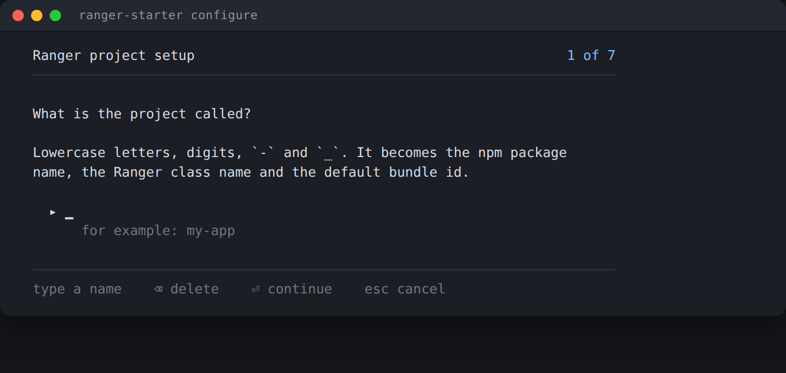

Lowercase letters, digits, `-` and `_`. It becomes the npm package name, the
Ranger class name and the default Android package and iOS bundle id, so the
wizard checks it against the same rule the planner validates with — a name the
wizard accepts cannot be a name the generator then rejects.

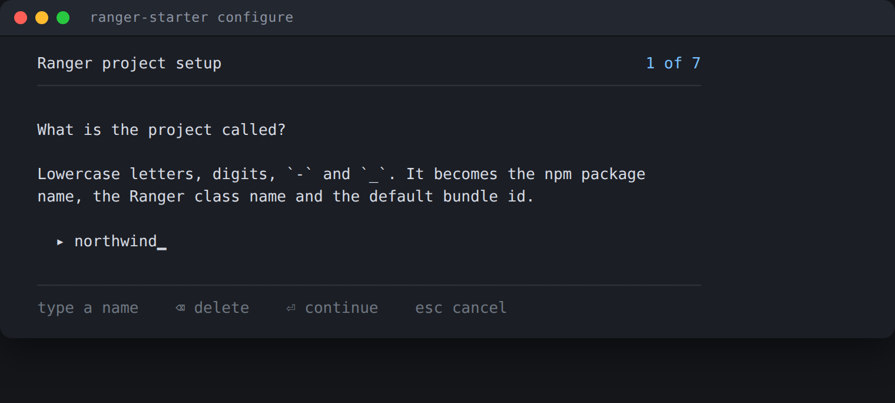

---

## 2 — Application or library

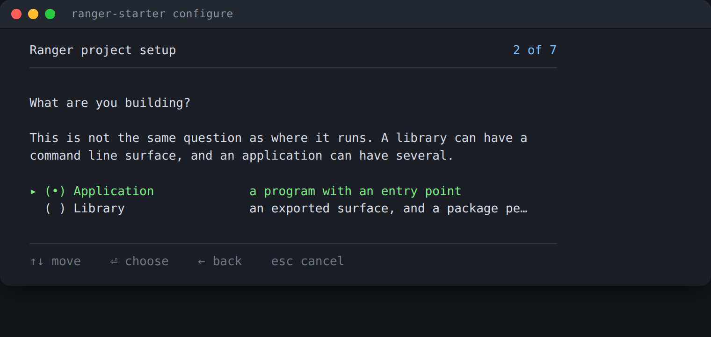

This is **not** the same question as where it runs, and that separation is the
one design decision everything else follows from. A library can have a command
line surface; an application can have several surfaces at once. They are
independent dimensions, and the configuration stores them that way.

---

## 3 — Where it runs

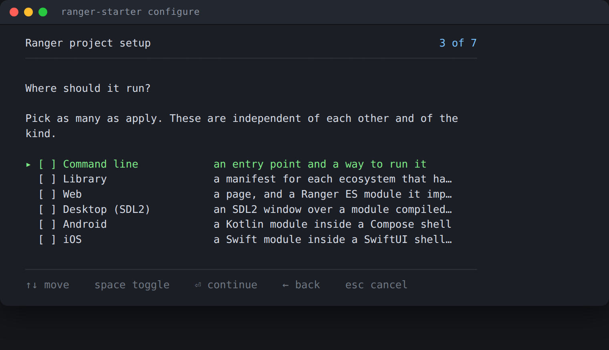

Pick as many as apply. All six generate — the wizard never offers a surface
`apply` would refuse, because the list comes from the profile registry rather
than a hand-kept table. A surface can still reach `ranger.project.json`'s
vocabulary before its profile exists; the wizard then draws it with a dash where
the checkbox goes and the reason beside it, and refuses to tick it. Nothing is
in that state today.

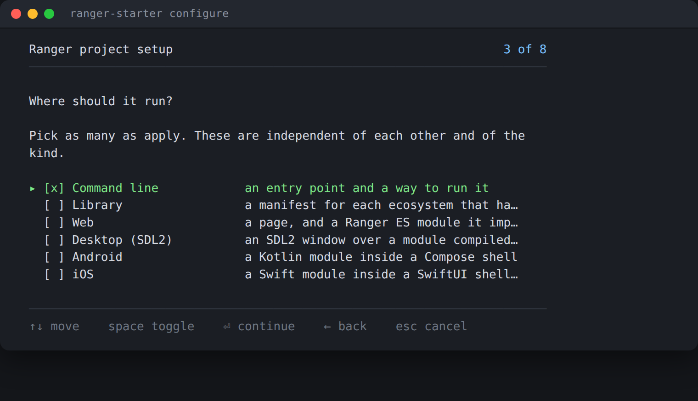

---

## 4 — Which languages

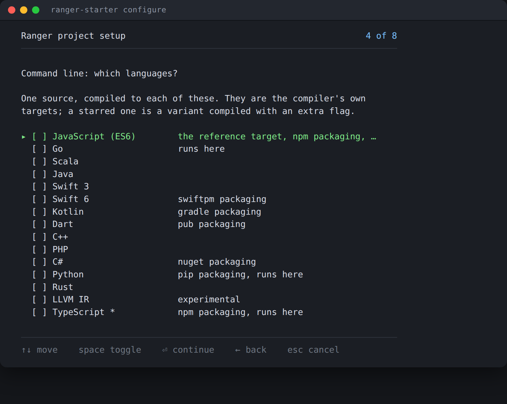

One source, compiled to each of these. The list is **the compiler's**, not the
wizard's: `ranger-starter` asks `rgrc -targets -json` and falls back to a bundled
table when the installed compiler is too old to answer — which today it always
is, so this is the bundled list. The hints come from the same table, so "npm
packaging" and "runs here" cannot drift from what the generated scripts do.

`TypeScript *` carries a star because it is not a `-l=` value: it compiles as
`-l=es6 -typescript`, and the generated script says so.

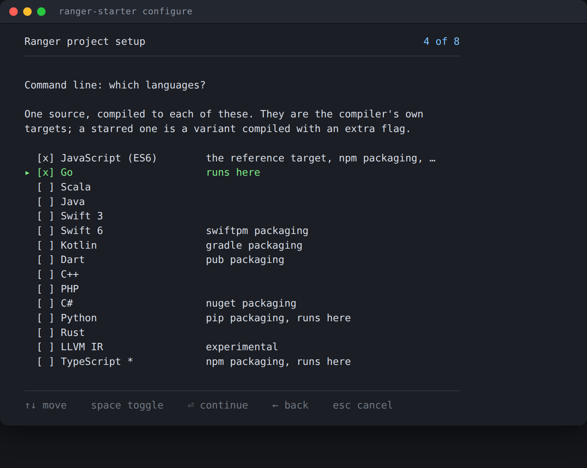

A surface with exactly one possible target — Android is Kotlin, iOS is Swift —
opens with it already ticked, so the question can be confirmed without reading
it.

---

## 4b — Which devices

Only Android and iOS ask this, because they are the only surfaces where the
answer is not derivable from anything else.

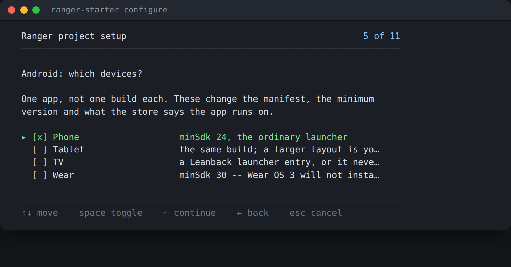

**These are not separate builds.** They are one app, and what they change is the
manifest, the minimum version and what the store says the app runs on:

| | |
| --- | --- |
| **Phone** | `minSdk 24`, the ordinary launcher |
| **Tablet** | the same build; a larger layout is yours to write |
| **TV** | adds `LEANBACK_LAUNCHER` and `androidx.tv:tv-material`. Without the category the app does not appear on a TV at all |
| **Wear** | forces `minSdk 30` — Wear OS 3 is API 30 and a lower minimum will not install — and adds the watch's own Compose material set |

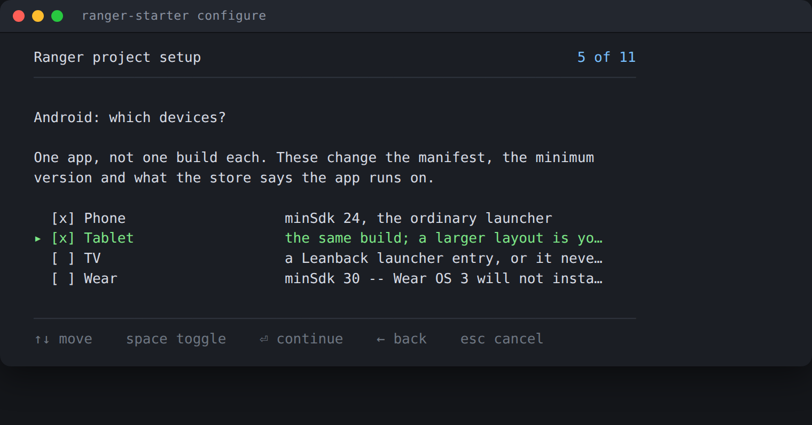

On iOS the same question is the `UIDeviceFamily` list in `Info.plist`, which is
the only difference between "an iPhone app" and "an iPad app" once the binary
exists:

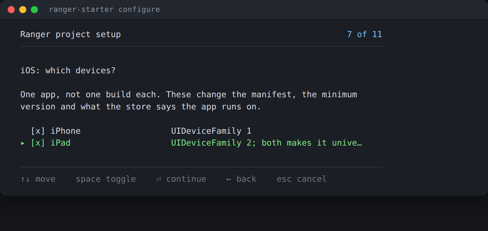

The two vocabularies do not overlap on purpose — Android has `phone`, iOS has
`iphone` — so one `--devices phone,tablet,iphone,ipad` on the command line is
routed to whichever surfaces know each name, and a name nobody knows is an
error rather than a silent default.

---

## 5 — Documentation

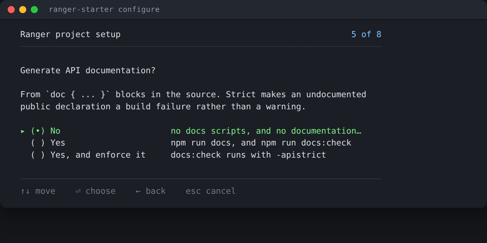

From `doc { … }` blocks in the source — the vocabulary the compiler already
parses. **Yes, and enforce it** adds `-apistrict` to `npm run docs:check`, which
makes an undocumented public declaration a build failure rather than a warning.

---

## 6 — Agents

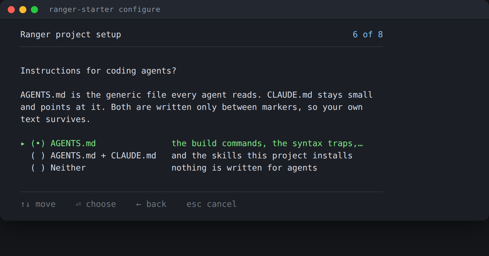

`AGENTS.md` is the generic file every coding agent reads: the exact commands, the
Ranger syntax traps, the generated-file policy, the per-surface rules. `CLAUDE.md`
stays small and points at it, and lists the skills the project installs.

Both are written **only between `<!-- ranger:start … -->` markers**. Everything
outside them is yours and is never touched, which is what makes re-running the
setup safe on a project you have been writing in.

---

## 7 — CI

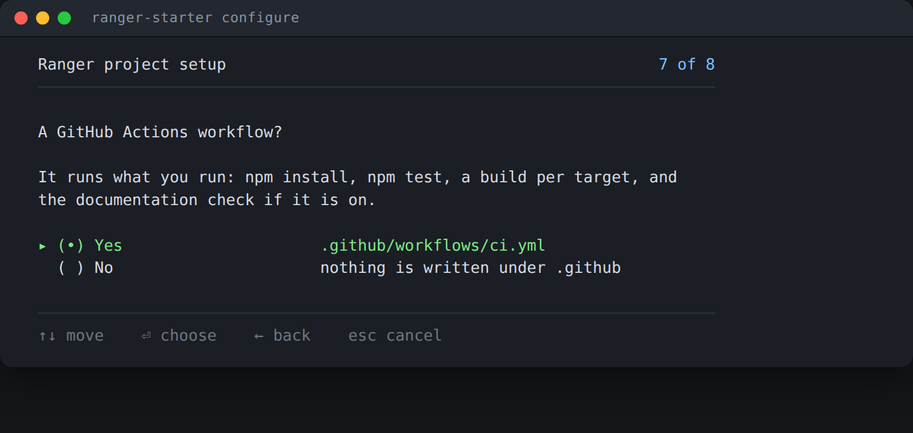

A workflow that runs what you run, in the order you run it: `npm install`,
`npm test`, a build per configured target, `docs:check` when documentation is on,
and `doctor` as a diagnostic step.

---

## 8 — Review

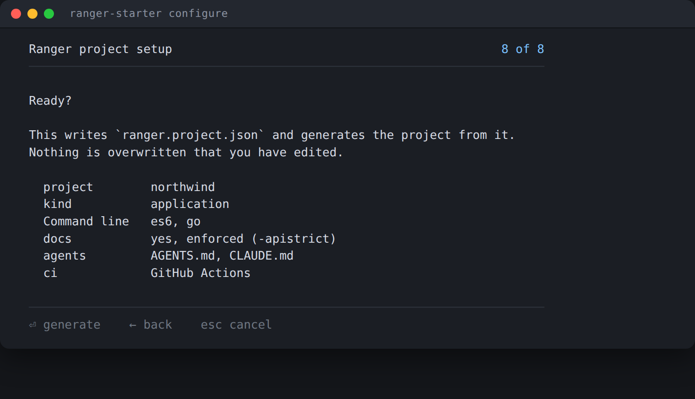

The answers, as the configuration about to be written. `←` goes back to any of
them. A mobile surface shows its devices beside its target, because that is half
the answer — a watch build and a phone build differ only there:

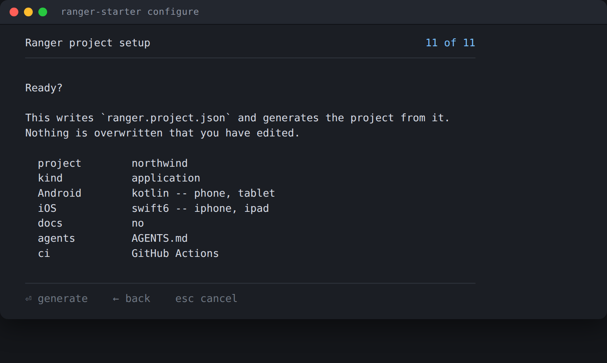

---

## What each surface generates

| | |
| --- | --- |
| **Command line** | `src/Main.rgr`, a test that exits non-zero, `scripts/rgr.js`, and a build script per target |
| **Library** | an entry point per ecosystem, and `package:<target>` for each target with a manifest — npm, pip, NuGet, Gradle/Dokka, SwiftPM, pub |
| **Web** | `web/index.html`, `web/main.js`, a Ranger ES module compiled into `web/generated/`, and Vite |
| **Android** | `platforms/android` — a Gradle project with a Compose shell — and `src/Shared.rgr` compiled to Kotlin into the app's source set |
| **iOS** | `platforms/ios/App.swift` — a SwiftUI shell — and `scripts/ios-build.rgr`, which builds a `.app` with no `.xcodeproj` and no `xcodebuild` |
| **Desktop (SDL2)** | `desktop/host/main.cpp` — a window and an event loop — and `desktop/CMakeLists.txt`, over the same module compiled to C++ |

The web surface has three details worth knowing, each of which is a trap
somebody would otherwise hit once:

- `src/Web.rgr` has **no `main`**. `-esm` exports every class *and* calls `main`
  at the bottom of the emitted file, so a `main` there would run on page load.
- **`-esm` is not optional.** Without it the es6 target writes CommonJS, and the
  failure arrives as a Vite error about `require` that reads like a bundler
  problem rather than a missing compiler flag.
- The compiled module lands **inside Vite's root**. A module outside it needs
  `server.fs.allow`, and getting that wrong produces a 403 in dev that says
  nothing useful.

### Three surfaces, one module

Desktop, Android and iOS all default to `src/Shared.rgr`, class `Shared`, and
compile **the same file** to C++, to Kotlin and to Swift. That is the point of
the language, and three near-identical modules would be the opposite of it. The
host shell on each platform owns the lifecycle, the loop and the pixels; the
Ranger module owns what the app knows, and has no `main` — the platform calls
the shell and the shell calls it.

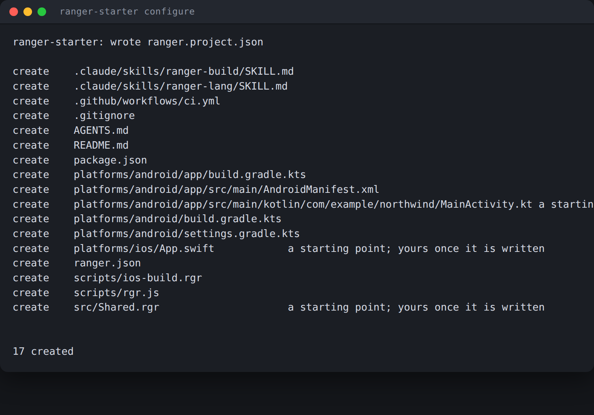

The class is called `Shared` rather than `App` because `App` is a **SwiftUI
protocol**: a class of that name makes the host's `struct NorthwindApp: App`
resolve to the wrong thing. The host struct is named from the project for the
same reason.

Three more things worth knowing before they cost an afternoon:

- **`-ktpackage` must match the host's `package` declaration.** Both come from
  `surfaces.android.package`, so they cannot disagree — but if you edit one by
  hand, the mismatch does not fail the Ranger compile. It fails later, in
  Gradle, as an unresolved reference to a class that is right there in the
  source set.
- **iOS generates everywhere and builds only on a Mac.** `npm run ios:plan`
  prints the whole build — SDK, triple, device families, every command line —
  and executes nothing, on Linux and Windows too. `npm run doctor` reports the
  Xcode tools as *unavailable* rather than *missing*, because "missing" would
  send somebody looking for something they cannot install.
- **There is no `.xcodeproj` and no `xcodebuild`.** `scripts/ios-build.rgr`
  drives `xcrun`, `swiftc`, `plutil` and `codesign` through `lib/apple`, which
  ships inside `ranger-compiler` — nothing to install and nothing to declare.

### The desktop surface

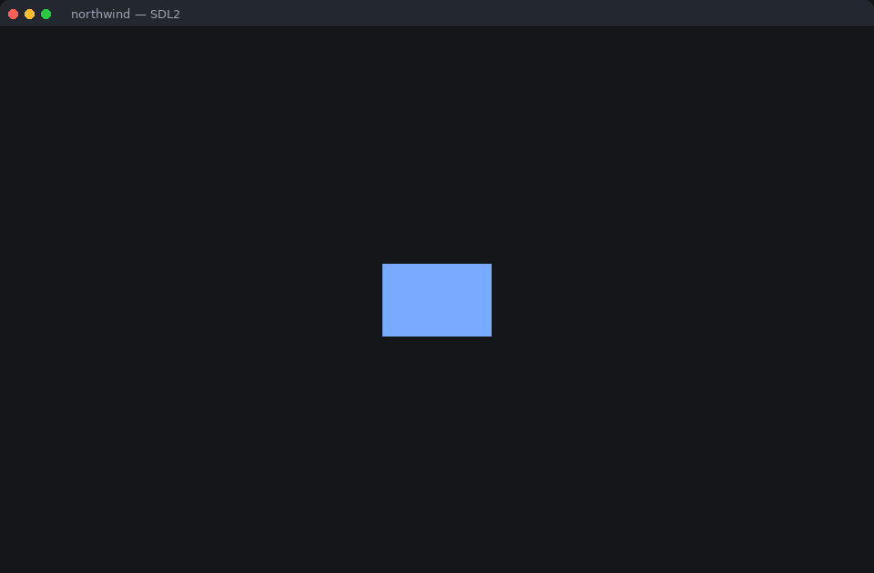

That picture was taken on a machine with **no display**. `SDL_RenderReadPixels`
reads back what the renderer drew rather than what a screen showed, so
`northwind 1 --shot window.bmp` under `SDL_VIDEODRIVER=dummy` is a real frame —
which is the point, because "it exited 0" does not prove anything was drawn.
`scripts/desktop-shot.sh` generates the project, builds it and takes the shot.

`desktop/host/main.cpp` opens an SDL2 window, pumps events and draws a frame.
The Ranger module is **included, not linked**: the C++ target emits one `.cpp`
with the class definitions in it and no header to go with them, so the host
`#include`s it and the program is one translation unit.

```bash
npm run desktop:compile   # Ranger -> C++
npm run desktop:build     # and cmake
npm run desktop:run       # and run it
npm run desktop:smoke     # 30 frames with SDL_VIDEODRIVER=dummy -- no window

./build/desktop-cmake/northwind 1 --shot window.bmp   # and a picture of it
```

- **SDL2 is discovered two ways, and it has to be.** `find_package(SDL2)` finds
  the config package Homebrew and vcpkg ship; `pkg_check_modules` finds the
  distribution one, which on Debian and Ubuntu is the only one there is. A
  project that knows only one of them fails on half the machines with a message
  about a missing package that *is* installed.
- **The renderer falls back to software.** A container, a VM or a CI runner has
  no accelerated renderer, and failing there rather than falling back is the
  single most common way a working SDL2 program looks broken.
- **`desktop:smoke` is the only one of the three host surfaces CI can prove.**
  `SDL_VIDEODRIVER=dummy` is SDL's own null driver: no window, no window
  manager, and so nothing that will ever close the program — which is why the
  binary takes a frame count. The generated workflow runs it, and installs
  `libsdl2-dev` first. Android wants an SDK and iOS wants a Mac, so neither asks
  to be in CI.
- **A window, not a UI toolkit.** Nothing is drawn but a rectangle, and no
  drawing library is pulled in. EVG — Ranger's layout engine, `lib/evg` — is MIT
  and can be vendored; the rasteriser and window layer the Ranger gallery
  applications present through are AGPL-3.0-or-later, and building a product on
  those puts the product under the AGPL. In this repository
  `scripts/add-gallery.sh` is the only way either arrives, and it says so first;
  a *generated* project has no such script, so see
  [LICENSING.md](https://github.com/terotests/Ranger/blob/master/LICENSING.md).
- **`-cpp-single-thread` is a config-file switch, not a question.**
  `surfaces.desktop.singleThread` drops the atomics from reference counting: the
  generated host starts no threads, so it is safe as generated, and a pointer
  copied across threads will corrupt its count. `plan` says so as a warning
  every time it is on. It stays out of the wizard because the honest default is
  off and anyone who needs it is already editing the file.

---

## Driving it without the questionnaire

The wizard needs a terminal and refuses a pipe. Everything it does is available
as flags and JSON, and an agent should start with one call that answers what
this build can actually do:

```bash
npx ranger-starter describe --json
```

That gives the commands and their flags, which surfaces this build can generate
(as opposed to which ones the config file has slots for), the targets the
installed compiler has, the skills it can install, and a configuration that
works. Then:

```bash
npx ranger-starter init --name shopfront --surfaces cli,web --targets es6 --json
npx ranger-starter init --name shopfront --surfaces android,ios \
    --devices phone,tablet,iphone --json
npx ranger-starter init --name shopfront --surfaces desktop --json
npx ranger-starter plan --json      # the actions apply will perform
npx ranger-starter apply --json
npx ranger-starter doctor --json    # what this machine is missing
```

Every command takes `--json`, **including the failures**. Exit status is 0 for
worked, 1 for a problem with the project, 2 for a problem with the command line.

`describe --json` carries the `--devices` vocabulary for every surface that has
one, with the default that applies when the flag names none:

```json
{ "id": "android", "available": true, "defaultTarget": "kotlin",
  "devices": ["phone", "tablet", "tv", "wear"], "devicesDefault": ["phone"] }
```

So an agent never has to guess whether a tablet is `tablet` or `tablets` — a
guess is a JSON error, not a default.

---

## And then it generates

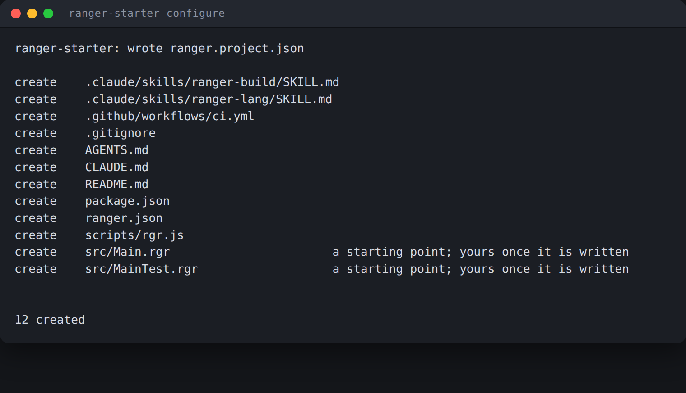

Twelve files, and `ranger.project.json` beside them as the source of truth.

Run it again and it will say `12 already correct` — generation is idempotent.
Turn a surface off and its files, its npm scripts and its `AGENTS.md` section go
away, while your own scripts and prose stay. Edit a generated file and the tool
notices and stops overwriting it, rather than clobbering your work.

```bash
npm run plan            # what would change; writes nothing
npm run setup           # the questions again
npm run doctor          # can this machine build what is configured?
```
