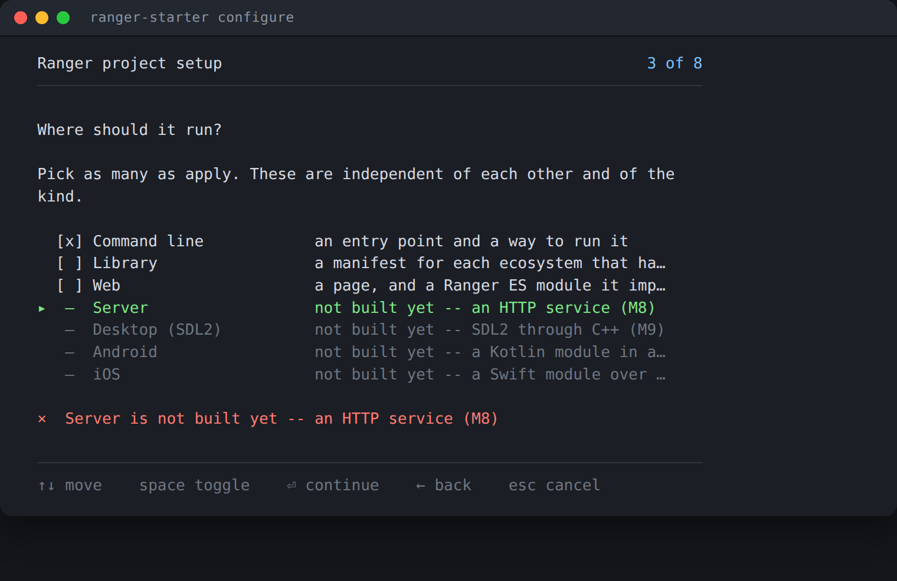

# The wizard

```bash
npm install
npx ranger-starter configure
```

Eight screens, and at the end a `ranger.project.json` and the project generated
from it.

**The wizard is a frontend.** It produces a configuration and nothing else — the
same file an agent writes by hand — so there is one generator and no second path
through it. If you would rather not answer questions:

```bash
ranger-starter init --name northwind --surfaces cli --targets es6,go --docs
ranger-starter plan       # what would change; writes nothing
ranger-starter apply
```

Every picture below is **generated from the wizard**, by driving the real program
inside a pty and screenshotting what it drew. The key scripts that produce them
are asserted in `src/starter/StarterTest.rgr`, so a picture that goes stale is a
test that fails. `npm run wizard:shots` rebuilds them.

---

## 1 — The name


Lowercase letters, digits, `-` and `_`. It becomes the npm package name, the
Ranger class name and the default Android package and iOS bundle id, so the
wizard checks it against the same rule the planner validates with — a name the
wizard accepts cannot be a name the generator then rejects.


---

## 2 — Application or library


This is **not** the same question as where it runs, and that separation is the
one design decision everything else follows from. A library can have a command
line surface; an application can have several surfaces at once. They are
independent dimensions, and the configuration stores them that way.

---

## 3 — Where it runs


Pick as many as apply. Four of the seven are not built yet — and they are
**shown**, with the milestone that will bring them, rather than hidden. Hiding
them would hide the plan; offering them as selectable would let you build a
configuration that fails to apply. So they are visible and refuse to be ticked:



---

## 4 — Which languages


One source, compiled to each of these. The list is **the compiler's**, not the
wizard's: `ranger-starter` asks `rgrc -targets -json` and falls back to a bundled
table when the installed compiler is too old to answer — which today it always
is, so this is the bundled list. The hints come from the same table, so "npm
packaging" and "runs here" cannot drift from what the generated scripts do.

`TypeScript *` carries a star because it is not a `-l=` value: it compiles as
`-l=es6 -typescript`, and the generated script says so.


---

## 5 — Documentation


From `doc { … }` blocks in the source — the vocabulary the compiler already
parses. **Yes, and enforce it** adds `-apistrict` to `npm run docs:check`, which
makes an undocumented public declaration a build failure rather than a warning.

---

## 6 — Agents


`AGENTS.md` is the generic file every coding agent reads: the exact commands, the
Ranger syntax traps, the generated-file policy, the per-surface rules. `CLAUDE.md`
stays small and points at it, and lists the skills the project installs.

Both are written **only between `<!-- ranger:start … -->` markers**. Everything
outside them is yours and is never touched, which is what makes re-running the
setup safe on a project you have been writing in.

---

## 7 — CI


A workflow that runs what you run, in the order you run it: `npm install`,
`npm test`, a build per configured target, `docs:check` when documentation is on,
and `doctor` as a diagnostic step.

---

## 8 — Review


The answers, as the configuration about to be written. `←` goes back to any of
them.

---

## What each surface generates

| | |
| --- | --- |
| **Command line** | `src/Main.rgr`, a test that exits non-zero, `scripts/rgr.js`, and a build script per target |
| **Library** | an entry point per ecosystem, and `package:<target>` for each target with a manifest — npm, pip, NuGet, Gradle/Dokka, SwiftPM, pub |
| **Web** | `web/index.html`, `web/main.js`, a Ranger ES module compiled into `web/generated/`, and Vite |

The web surface has three details worth knowing, each of which is a trap
somebody would otherwise hit once:

- `src/Web.rgr` has **no `main`**. `-esm` exports every class *and* calls `main`
  at the bottom of the emitted file, so a `main` there would run on page load.
- **`-esm` is not optional.** Without it the es6 target writes CommonJS, and the
  failure arrives as a Vite error about `require` that reads like a bundler
  problem rather than a missing compiler flag.
- The compiled module lands **inside Vite's root**. A module outside it needs
  `server.fs.allow`, and getting that wrong produces a 403 in dev that says
  nothing useful.

---

## Driving it without the questionnaire

The wizard needs a terminal and refuses a pipe. Everything it does is available
as flags and JSON, and an agent should start with one call that answers what
this build can actually do:

```bash
npx ranger-starter describe --json
```

That gives the commands and their flags, which surfaces this build can generate
(as opposed to which ones the config file has slots for), the targets the
installed compiler has, the skills it can install, and a configuration that
works. Then:

```bash
npx ranger-starter init --name shopfront --surfaces cli,web --targets es6 --json
npx ranger-starter plan --json      # the actions apply will perform
npx ranger-starter apply --json
npx ranger-starter doctor --json    # what this machine is missing
```

Every command takes `--json`, **including the failures**. Exit status is 0 for
worked, 1 for a problem with the project, 2 for a problem with the command line.

---

## And then it generates


Twelve files, and `ranger.project.json` beside them as the source of truth.

Run it again and it will say `12 already correct` — generation is idempotent.
Turn a surface off and its files, its npm scripts and its `AGENTS.md` section go
away, while your own scripts and prose stay. Edit a generated file and the tool
notices and stops overwriting it, rather than clobbering your work.

```bash
npm run plan            # what would change; writes nothing
npm run setup           # the questions again
npm run doctor          # can this machine build what is configured?
```
